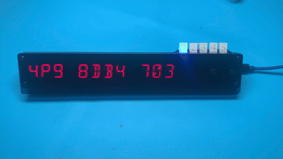
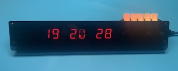

# Circuitpython Demo for the UnexpectedMaker WOPR Kit 

More or less a circuitpython implementation of the Arduino WOPR demo by UnexpectedMaker:
https://github.com/UnexpectedMaker/wopr

By default it will connect to Wifi, set the clock and display the time with rainbow defcon LEDs.  (setup in secrets.py)

If you push BUT1 it will do a short audio/text demo to show things work 

If you push BUT2 it will imitate the classic 'WarGames' codebreaking sequence.  

If you push BUT3 (on the back of the WOPR board) it will do the UnexpectedMaker codebreaking sequence 

If you push BUT4 (on the back of the WOPR board) it will scroll a secret message 

During codebreaking sequences you can push BUT2 to abort and go back to the clock 

Some minor informative messages are output to the serial usb during operation. 

Does it do everything in the UM Arduino WOPR demo?  No it does not. But it shows how to do things with WOPR in circuitpython: display, audio, buttons, LEDs

Tested with Adafruit CircuitPython 8.2.6 on 2023-09-12; TinyS3 with ESP32S3.  My WOPR has the analog audio shield installed.  

Copy `code.py`,`tinys3.py`, and `secrets.py` to your WOPR's TinyS3.  Edit `secrets.py` for your wifi credentials and time zone. 

These Circuitpython libraries are in /lib:
`adafruit_bus_device`, `adafruit_ht16k33`, `adafruit_debouncer`, `adafruit_ntp`, `adafruit_ticks`

Does it work on a TinyPICO?  Dunno I don't have a TinyPICO, your mileage may vary. 

WOPR kit available here: 
https://unexpectedmaker.com/shop.html#!/W-O-P-R-Missile-Launch-Code-Display-Kit-HAXORZ-II/p/578899083/category=154506548 